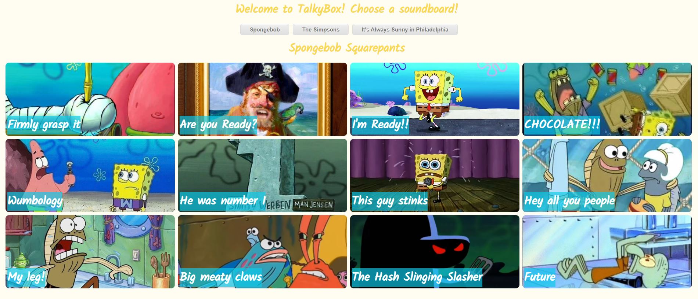

# Talkybox

<h1 id="intro">Introduction</h1>
Talkybox is a full-stack web application for a nostalgic look back at timeless quotes from iconic television series. Currently available are quotes from Spongebob, The Simpsons, and It's Always Sunny in Philadelphia, with more on the way!

<h1 id="user_guide">User Guide</h1>
Go to <a href="https://talkybox.herokuapp.com">talkybox.herokuapp.com</a> to see Talkybox in action!

## To start the app:

### Run

### `go run main.go`

Open localhost:5000 to open the app in the browser.
<h1 id="tech_stack">Tech Stack</h1>
Front-end: React  
Back-end: Golang, PostgreSQL

<h6>This was developed during my time as a student at <a href="https://github.com/codechrysalis">Code Chrysalis</a>.</h6>